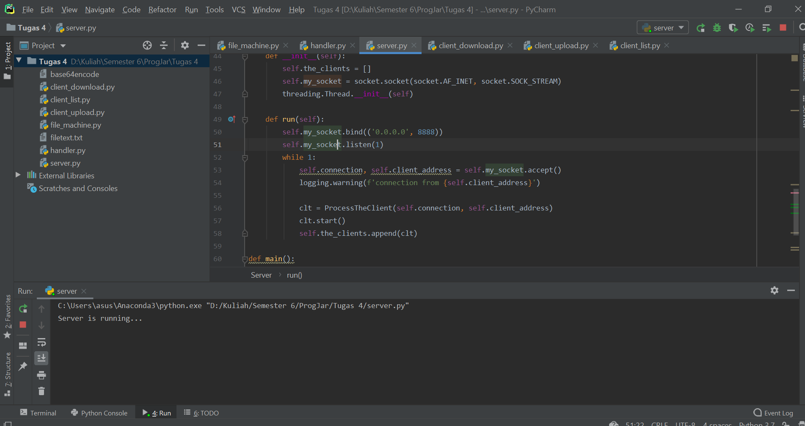
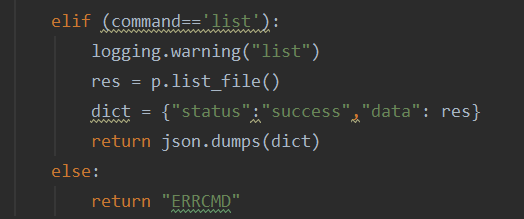

## Nomor 1
**Server**

**Meletakkan File (Upload)**
File yang akan di upload (filetxt.txt) harus berada di dalam direktori utama terlebih dahulu, maka setelah di upload file tersebut akan terletak di dalam direktori "dir".

Sekarang, filetxt.txt juga berada di dalam folder "dir".

**Mengambil File (Download)**
File yang akan di download (perry.jpg) harus berada di dalam direktori "dir" terlebih dahulu, maka setelah di upload file akan terletak di dalam direktori utama.

Sekarang, perry.jpg juga berada di dalam direktori utama.

**Melihat List File (List)**
Untuk melihat isi dari folder "dir", maka jalankan list file dan hasilnya akan seperti ini :

## Nomor 2
**Rancangan Protokol**

## Nomor 3
**Penggunaan JSON**
Berikut adalah bukti pengunaan JSON untuk menampilkan isi (List) file :

Hasil dari penggunaan JSON untuk melihat list file adalah sebagai berikut :

## Nomor 4
Untuk melihat client dari setiap fitur dapat diakses di bawah ini :
- Untuk client yang bertugas meletakkan file dapat diakses di [client_upload.py](client_upload.py)
- Untuk client yang bertugas mengambil file dapat diakses di [client_download.py](client_download.py)
- Untuk client yang bertugas melihat isi file dapat diakses di [client_list.py](client_list.py)
