## Tabulasi hasil performance test untuk tiap concurrency
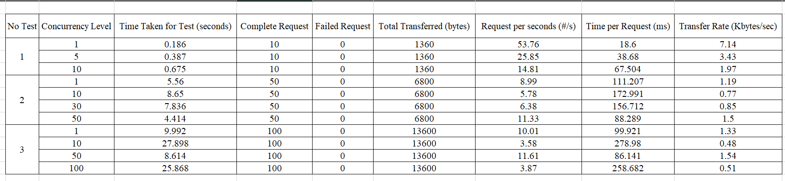

## Benchmark dengan menjalankan request sebanyak 10
### Concurrency 1
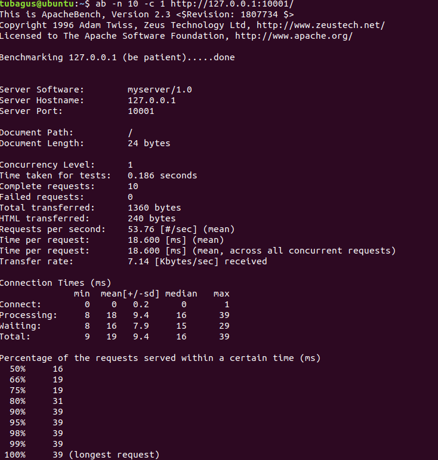

### Concurrency 5
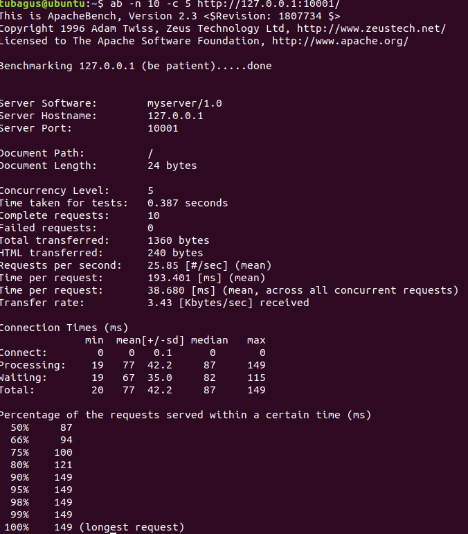

### Concurrency 10
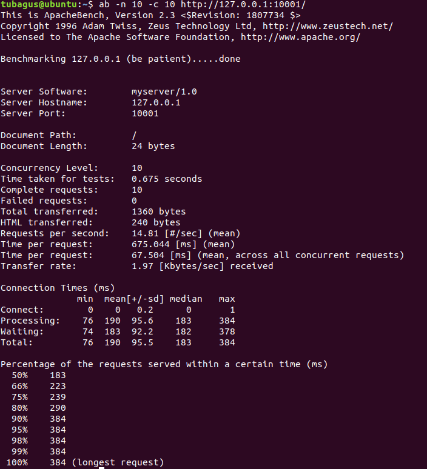

## Benchmark dengan menjalankan request sebanyak 50
### Concurrency 1
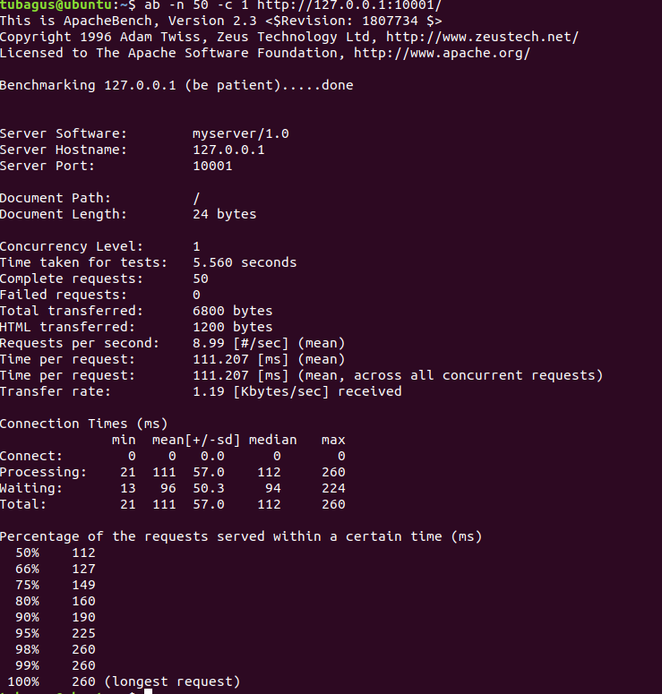

### Concurrency 10
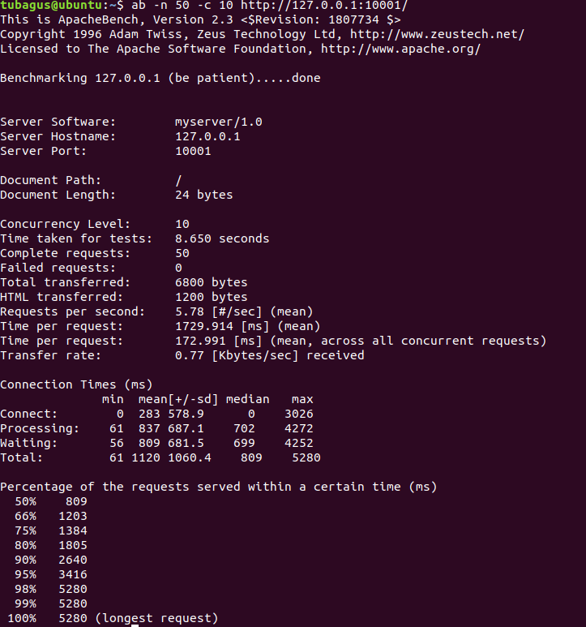

### Concurrency 30
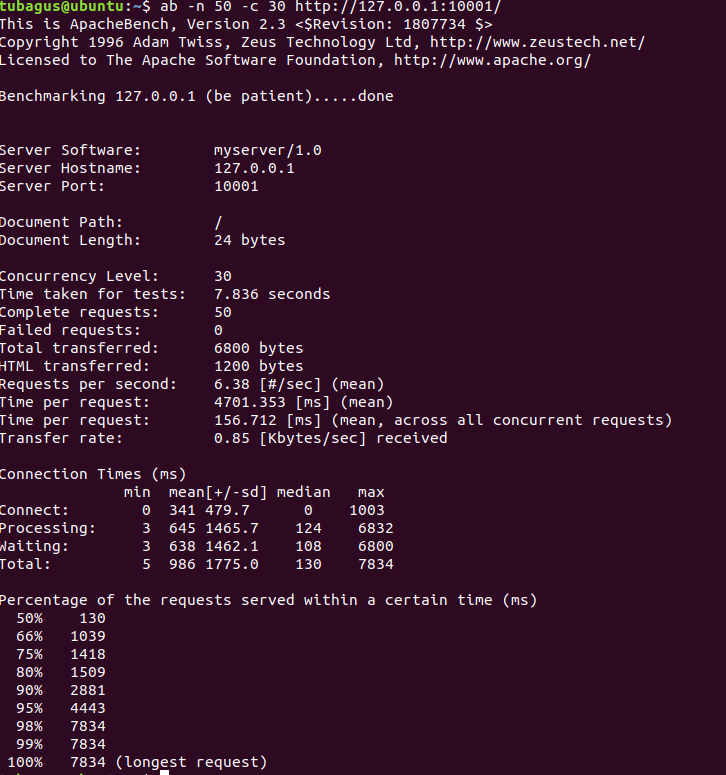

### Concurrency 50
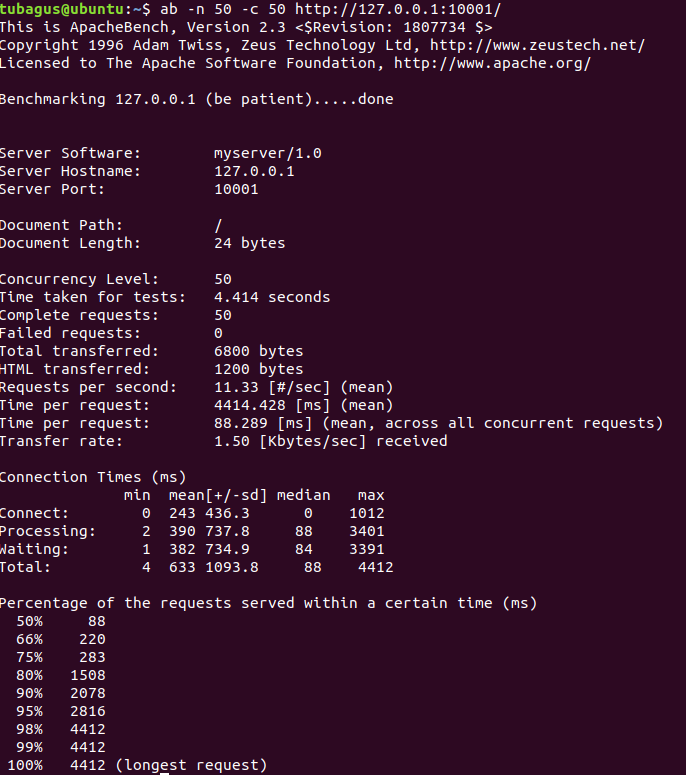

## Benchmark dengan menjalankan request sebanyak 100
### Concurrency 1
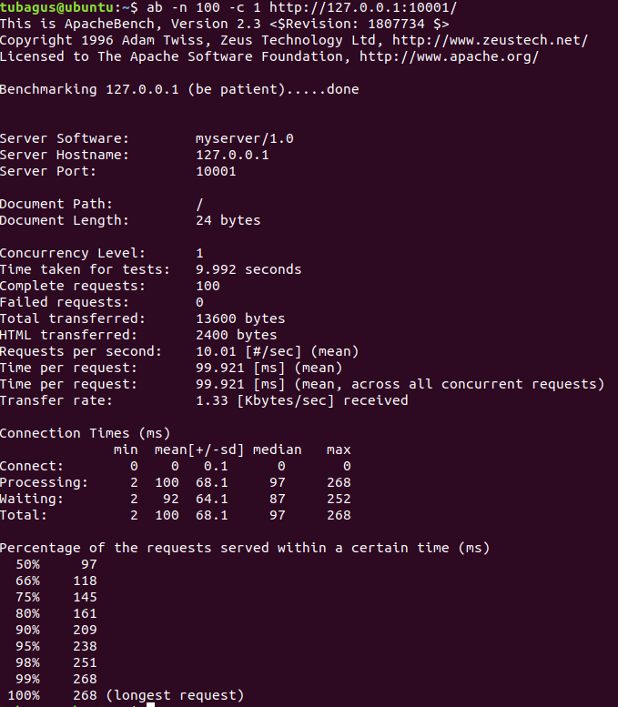

### Concurrency 10
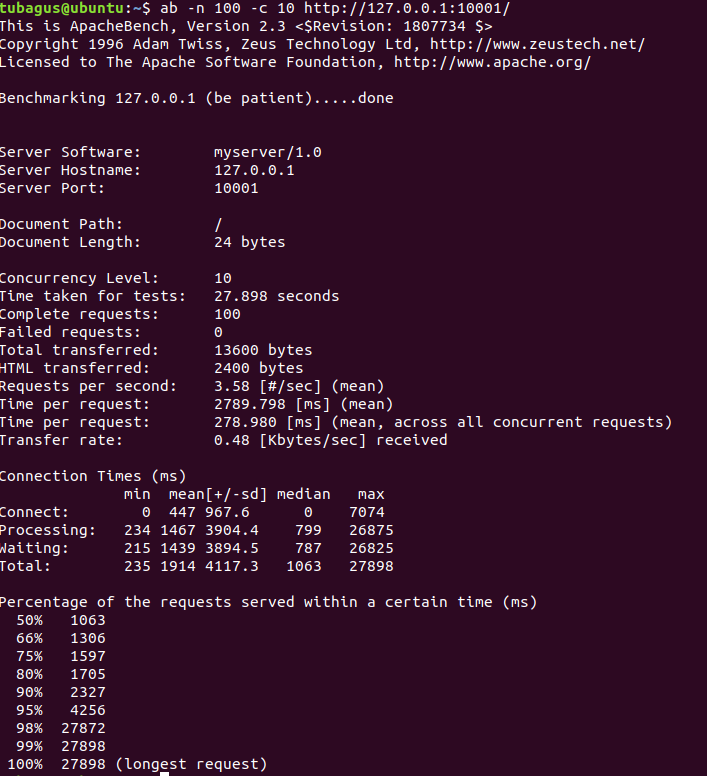

### Concurrency 50
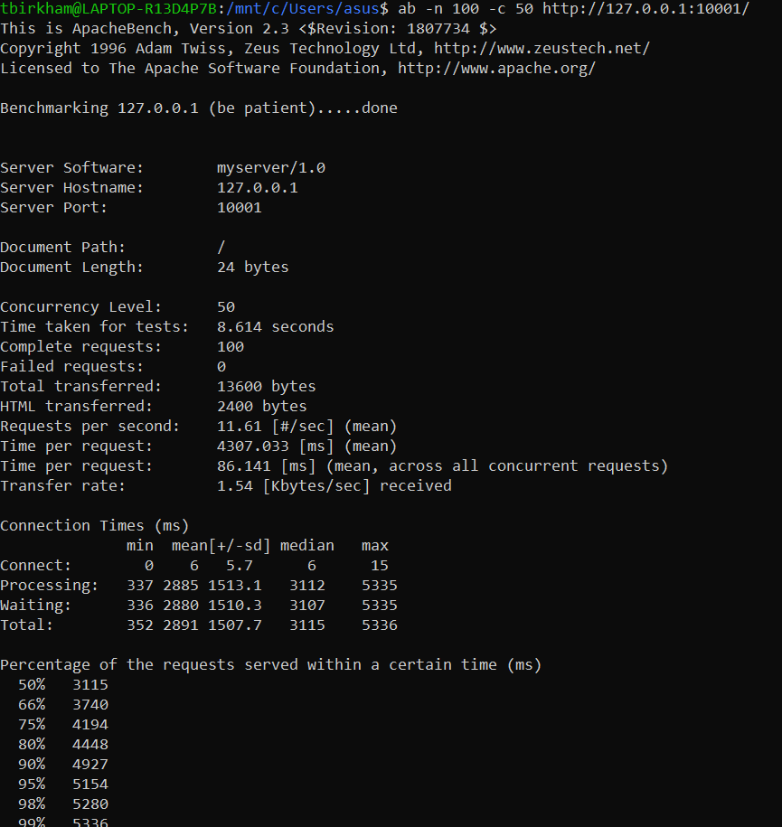

### Concurrency 100
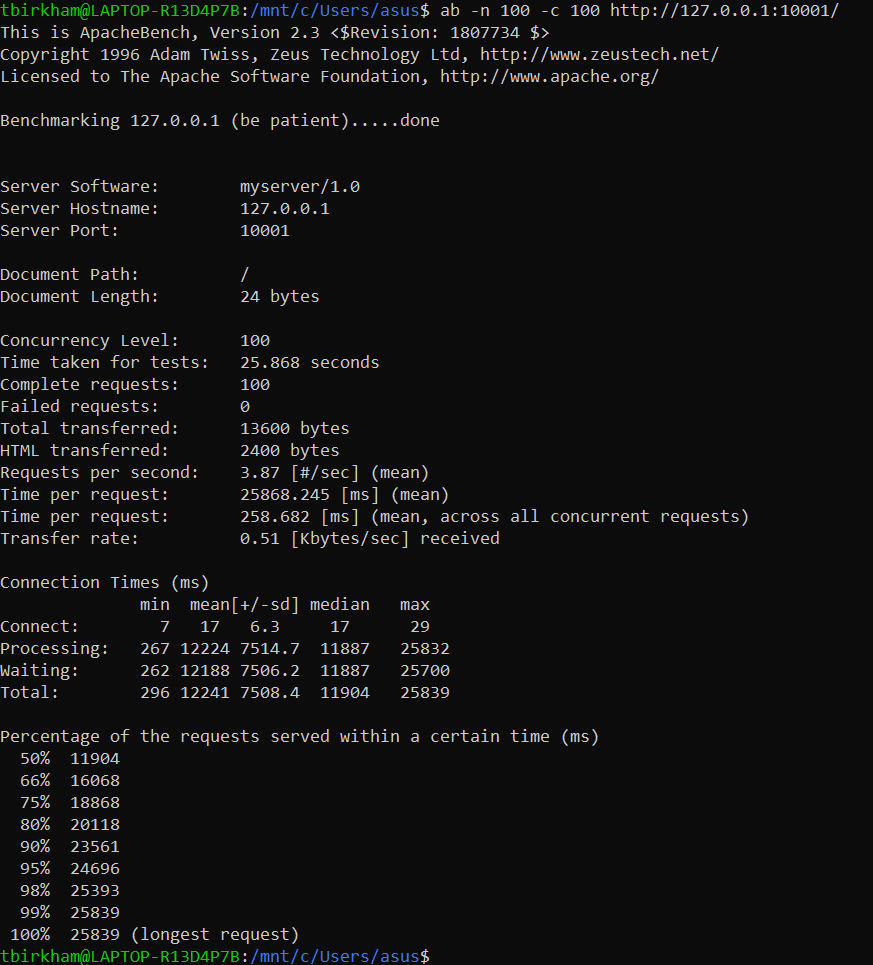
